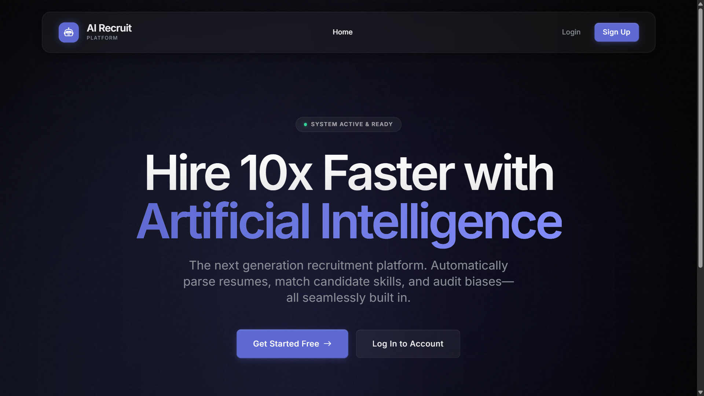
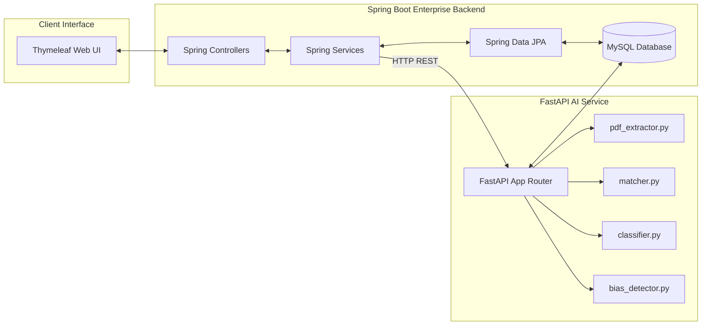

<h1 align="center">
  <br>
  
  <br>
  RecruitAI
  <br>
</h1>

<h4 align="center">An Enterprise-Grade AI-Powered CV Matching, Parsing & Algorithmic Fairness Auditing Platform. Built on Spring Boot & FastAPI.</h4>

<p align="center">
  
  
  
  
</p>

<p align="center">
  
  
  
</p>

<p align="center">
  <a href="#key-features">Key Features</a> •
  <a href="#system-architecture">System Architecture</a> •
  <a href="#tech-stack">Tech Stack</a> •
  <a href="#installation-and-setup">Installation</a> •
  <a href="#algorithmic-fairness">Fairness Check</a> •
  <a href="#contributors">Contributors</a>
</p>

---

## 🖥️ Platform Showcase

<p align="center">
  
</p>

---

## 🚀 Key Features

*   📂 **Multi-Modal CV Parsing**: Combines native `PyPDF2` text extraction with `Tesseract OCR` fallbacks, feeding into **Google Gemini 2.5 Flash** structured schema generation to map resumes with high confidence.
*   🧠 **Semantic Skill Matching**: Uses local **SentenceTransformers** (`all-MiniLM-L6-v2`) to perform vector cosine similarity matching between CV profiles and Job Descriptions, avoiding false positive matches.
*   📊 **Predictive Machine Learning Ranking**: Computes overall candidate fit using a pre-trained **Random Forest Regressor** and tiers career levels (Junior, Mid, Senior) using a custom **Decision Tree Classifier**.
*   ⚖️ **Algorithmic Fairness Check**: Runs real-time bias audits by synthetically cloning candidates into 16 demographic variants to monitor parity across 12 protected traits (gender, age, ethnicity, religion, disability, etc.).
*   🎙️ **Anonymized AI Interviewer**: Purges candidate PII and leverages **OpenRouter LLMs** to generate customized behavioral and technical interview questions based on the candidate's specific skill gaps.
*   🛡️ **Enterprise Security & Role Access**: Integrates robust Spring Security supporting role-based access for HR Managers, Candidates, and System Administrators.

---

## 🏛️ System Architecture

RecruitAI leverages a decoupled dual-service microservice layout connected via HTTP REST API boundaries:



---

## 🛠️ Tech Stack

<table align="center">
  <tr>
    <td align="center" width="96">
      
      <br>Java 21
    </td>
    <td align="center" width="96">
      
      <br>Spring Boot
    </td>
    <td align="center" width="96">
      
      <br>MySQL
    </td>
    <td align="center" width="96">
      
      <br>Python 3.10+
    </td>
    <td align="center" width="96">
      
      <br>FastAPI
    </td>
    <td align="center" width="96">
      
      <br>Thymeleaf
    </td>
  </tr>
</table>

---

## 📊 Project Metrics & Architecture Health

To ensure 100% stability and zero external network downtime dependencies, our codebase status is tracked via a localized audit matrix:

<table align="center">
  <thead>
    <tr style="background-color: #161b22;">
      <th align="left">🛠️ Component</th>
      <th align="left">💻 Technologies & Libraries</th>
      <th align="left">🎯 Primary Role</th>
      <th align="left">📈 Status</th>
    </tr>
  </thead>
  <tbody>
    <tr>
      <td>📂 <strong>Backend Core</strong></td>
      <td>Java 21, Spring Boot, JPA, Spring Security, Thymeleaf</td>
      <td>Business logic, Secure JWT/Session Auth, Relational orchestration</td>
      <td></td>
    </tr>
    <tr>
      <td>🧠 <strong>AI/ML Engine</strong></td>
      <td>Python 3.10+, FastAPI, SentenceTransformers, Scikit-Learn</td>
      <td>Multi-modal parsing, Semantic similarity scoring, Decision Tree ranking</td>
      <td></td>
    </tr>
    <tr>
      <td>💾 <strong>Database Layer</strong></td>
      <td>MySQL 8.0+, SQL Caching, SQLAlchemy Core</td>
      <td>Relational models mapping, SHA-256 Vector Embeddings cache</td>
      <td></td>
    </tr>
    <tr>
      <td>⚖️ <strong>Fairness Audit</strong></td>
      <td>Synthetic Mutation Engine, Demographic Parity check</td>
      <td>Combating algorithmic recruitment bias across 12 protected traits</td>
      <td></td>
    </tr>
  </tbody>
</table>

---

## ⚙️ Installation and Setup

### Prerequisites
*   **Java JDK 21+**
*   **MySQL Server 8.0+**
*   **Python 3.10+** (with virtual environment support)
*   **Tesseract OCR** (for image text fallback)

### Step 1: Database Setup
Launch MySQL Workbench or terminal and create the relational schema:
```sql
CREATE DATABASE aiml_project CHARACTER SET utf8mb4 COLLATE utf8mb4_unicode_ci;
```

### Step 2: Spring Boot Backend
1. Create your local properties file from the provided example:
   ```bash
   cp backend/src/main/resources/application.properties.example backend/src/main/resources/application.properties
   ```
2. Update the database password on Line 7:
   ```properties
   spring.datasource.password=YOUR_MYSQL_PASSWORD
   ```
3. Boot up the server:
   ```bash
   cd backend
   ./mvnw spring-boot:run
   ```
   *The backend will run on **http://localhost:8080***

### Step 3: FastAPI Python ML Service
1. Create your local environment file:
   ```bash
   cp cv_model/.env.example cv_model/.env
   ```
2. Update the `.env` keys securely (ask the project lead for keys):
   ```env
   GEMINI_API_KEY=your_gemini_api_key_here
   OPENROUTER_API_KEY=your_openrouter_key_here
   ```
3. Initialize the Python virtual environment and run the server:
   ```bash
   cd cv_model
   python -m venv .venv
   source .venv/bin/activate  # On Windows use: .venv\Scripts\activate
   pip install -r requirements.txt
   python api.py
   ```
   *The FastAPI AI service will run on **http://localhost:8000***

---

## ⚖️ Algorithmic Fairness & Bias Auditing

RecruitAI guarantees fairness by auditing candidate scores across **12 protected axes**. You can run a direct algorithmic health check via the API:

```http
POST http://localhost:8000/fairness-audit
```

**Audit Response Metrics**:
```json
{
  "status": "PASSED",
  "failures": [],
  "details": {
    "Baseline": {"score": 92.5, "status": "FAIR"},
    "Gender_FemaleName": {"score": 92.5, "status": "FAIR"},
    "Age_Older_GenX": {"score": 92.5, "status": "FAIR"},
    "Ethnicity_NameA": {"score": 92.5, "status": "FAIR"}
  }
}
```
---
<p align="center">
  Distributed under the MIT License. See <code>LICENSE</code> for more information.
</p>
